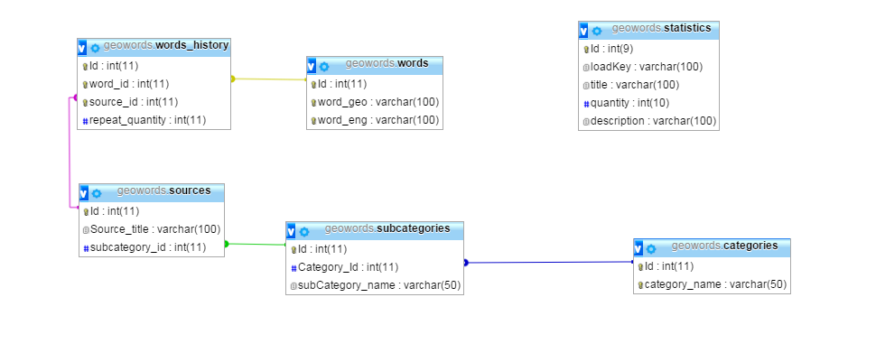

# GeoWordsDatabase
This Mysql database contains around 310 000 unique Georgian words. 

 check [db statistics](http://bumbeishvili.github.io/GeoWordsDatabase/) and [words cloud visualization](https://bl.ocks.org/bumbeishvili/raw/9ca6cdcfdd50b36af09c0b9d729a4adb/2d941a6fbba72c7cdfba6e2b947671a43cc1f70c/)
 
 # Other datasets
 1. [akalongman (Avtandil Kikabidze) / geo-words](https://github.com/akalongman/geo-words)  
 2. [0xh3x (Giorgi Jvaridze) / scraped-words](https://github.com/bumbeishvili/GeoWordsDatabase/tree/master/DifferentDatasets/Scraped)
 3. [sandrinio( Sandro Sukhitashvili) / Scraped / GeoWordsDatabase](https://github.com/sandrinio1/GeorgianWordsDataBase)
 4. [Kevin Scannell / Scraped](http://crubadan.org/languages/ka)
 
 
 
 # Linked Applications
 * [geowords](https://github.com/bumbeishvili/geoWords) - web client  (web app is not online)  
 * [ritma](https://github.com/bumbeishvili/ionic2-apps#ritma) - mobile client  (apk can be downloaded, but is not in play store)  
 * [რითმა](https://github.com/bumbeishvili/fb-ritma-messenger-bot) - fb chat bot (online)  
 
 
# Database structure

# Statistics

 

        

            

                
უნიკალური სიტყვების რაოდენობა

                

                    <h3 class="text-center col-centered ng-binding" ng-bind="widgetStatistics.UniqueWordsCount|number:0">309,916</h3>
                

            

        

        

            

                
მთლიანი სიტყვების რაოდენობა

                

                    <h3 class="text-center col-centered ng-binding" ng-bind="widgetStatistics.AllWordsCount|number:0">2,970,640</h3>
                

            

        

        

            

                
ასო-ბგერების რაოდენობა

                

                    <h3 class="text-center col-centered ng-binding" ng-bind="widgetStatistics.AllCharCount|number:0">19,737,919</h3>
                

            

        

        

            

                
 ყველაზე განმეორებადი სიტყვა 

                

                    <h3 class="text-center col-centered">
                        და
                        (4.46 %)
                    </h3>
                

            

        

        

            

                
ყველაზე განმეორებადი ასო-ბგერა

                

                    <h3 class="text-center col-centered">
                        ა
                        (15.01 %) 
                    </h3>
                

            

        

        

            

                
 ნაკლებ განმეორებადი ასო-ბგერა

                

                    <h3 class="text-center col-centered">
                        ჟ
						(0.07 %) 
                    </h3>
                

            

        

    

    

        

            

                
 33  ყველაზე განმეორებადი სიტყვა 

                <table class="table table-striped table-bordered table-hover">
                    <tbody><tr>
                        <th>#</th>
                        <th class="ng-binding">სიტყვა</th>
                        <th class="ng-binding">რაოდენობა ბაზაში</th>
                        <th class="ng-binding">პროცენტული ფარდობა</th>
                    </tr>
                    <!-- ngRepeat: item in commonWords --><tr ng-repeat="item in commonWords" class="ng-scope">
                        <td ng-bind="$index+1" class="ng-binding">1</td>
                        <td ng-bind="item.title" class="ng-binding">და</td>
                        <td ng-bind="item.quantity|number:0" class="ng-binding">132,585</td>
                        <td ng-bind="(item.quantity/widgetStatistics.AllWordsCount*100|number:3)+' %'" class="ng-binding">4.463 %</td>
                    </tr><!-- end ngRepeat: item in commonWords --><tr ng-repeat="item in commonWords" class="ng-scope">
                        <td ng-bind="$index+1" class="ng-binding">2</td>
                        <td ng-bind="item.title" class="ng-binding">რომ</td>
                        <td ng-bind="item.quantity|number:0" class="ng-binding">26,542</td>
                        <td ng-bind="(item.quantity/widgetStatistics.AllWordsCount*100|number:3)+' %'" class="ng-binding">0.893 %</td>
                    </tr><!-- end ngRepeat: item in commonWords --><tr ng-repeat="item in commonWords" class="ng-scope">
                        <td ng-bind="$index+1" class="ng-binding">3</td>
                        <td ng-bind="item.title" class="ng-binding">არ</td>
                        <td ng-bind="item.quantity|number:0" class="ng-binding">24,154</td>
                        <td ng-bind="(item.quantity/widgetStatistics.AllWordsCount*100|number:3)+' %'" class="ng-binding">0.813 %</td>
                    </tr><!-- end ngRepeat: item in commonWords --><tr ng-repeat="item in commonWords" class="ng-scope">
                        <td ng-bind="$index+1" class="ng-binding">4</td>
                        <td ng-bind="item.title" class="ng-binding">ამ</td>
                        <td ng-bind="item.quantity|number:0" class="ng-binding">14,984</td>
                        <td ng-bind="(item.quantity/widgetStatistics.AllWordsCount*100|number:3)+' %'" class="ng-binding">0.504 %</td>
                    </tr><!-- end ngRepeat: item in commonWords --><tr ng-repeat="item in commonWords" class="ng-scope">
                        <td ng-bind="$index+1" class="ng-binding">5</td>
                        <td ng-bind="item.title" class="ng-binding">ეს</td>
                        <td ng-bind="item.quantity|number:0" class="ng-binding">13,588</td>
                        <td ng-bind="(item.quantity/widgetStatistics.AllWordsCount*100|number:3)+' %'" class="ng-binding">0.457 %</td>
                    </tr><!-- end ngRepeat: item in commonWords --><tr ng-repeat="item in commonWords" class="ng-scope">
                        <td ng-bind="$index+1" class="ng-binding">6</td>
                        <td ng-bind="item.title" class="ng-binding">თუ</td>
                        <td ng-bind="item.quantity|number:0" class="ng-binding">13,429</td>
                        <td ng-bind="(item.quantity/widgetStatistics.AllWordsCount*100|number:3)+' %'" class="ng-binding">0.452 %</td>
                    </tr><!-- end ngRepeat: item in commonWords --><tr ng-repeat="item in commonWords" class="ng-scope">
                        <td ng-bind="$index+1" class="ng-binding">7</td>
                        <td ng-bind="item.title" class="ng-binding">რომელიც</td>
                        <td ng-bind="item.quantity|number:0" class="ng-binding">11,946</td>
                        <td ng-bind="(item.quantity/widgetStatistics.AllWordsCount*100|number:3)+' %'" class="ng-binding">0.402 %</td>
                    </tr><!-- end ngRepeat: item in commonWords --><tr ng-repeat="item in commonWords" class="ng-scope">
                        <td ng-bind="$index+1" class="ng-binding">8</td>
                        <td ng-bind="item.title" class="ng-binding">იყო</td>
                        <td ng-bind="item.quantity|number:0" class="ng-binding">11,768</td>
                        <td ng-bind="(item.quantity/widgetStatistics.AllWordsCount*100|number:3)+' %'" class="ng-binding">0.396 %</td>
                    </tr><!-- end ngRepeat: item in commonWords --><tr ng-repeat="item in commonWords" class="ng-scope">
                        <td ng-bind="$index+1" class="ng-binding">9</td>
                        <td ng-bind="item.title" class="ng-binding">ა</td>
                        <td ng-bind="item.quantity|number:0" class="ng-binding">11,682</td>
                        <td ng-bind="(item.quantity/widgetStatistics.AllWordsCount*100|number:3)+' %'" class="ng-binding">0.393 %</td>
                    </tr><!-- end ngRepeat: item in commonWords --><tr ng-repeat="item in commonWords" class="ng-scope">
                        <td ng-bind="$index+1" class="ng-binding">10</td>
                        <td ng-bind="item.title" class="ng-binding">კი</td>
                        <td ng-bind="item.quantity|number:0" class="ng-binding">11,448</td>
                        <td ng-bind="(item.quantity/widgetStatistics.AllWordsCount*100|number:3)+' %'" class="ng-binding">0.385 %</td>
                    </tr><!-- end ngRepeat: item in commonWords --><tr ng-repeat="item in commonWords" class="ng-scope">
                        <td ng-bind="$index+1" class="ng-binding">11</td>
                        <td ng-bind="item.title" class="ng-binding">მაგრამ</td>
                        <td ng-bind="item.quantity|number:0" class="ng-binding">11,055</td>
                        <td ng-bind="(item.quantity/widgetStatistics.AllWordsCount*100|number:3)+' %'" class="ng-binding">0.372 %</td>
                    </tr><!-- end ngRepeat: item in commonWords --><tr ng-repeat="item in commonWords" class="ng-scope">
                        <td ng-bind="$index+1" class="ng-binding">12</td>
                        <td ng-bind="item.title" class="ng-binding">ან</td>
                        <td ng-bind="item.quantity|number:0" class="ng-binding">10,780</td>
                        <td ng-bind="(item.quantity/widgetStatistics.AllWordsCount*100|number:3)+' %'" class="ng-binding">0.363 %</td>
                    </tr><!-- end ngRepeat: item in commonWords --><tr ng-repeat="item in commonWords" class="ng-scope">
                        <td ng-bind="$index+1" class="ng-binding">13</td>
                        <td ng-bind="item.title" class="ng-binding">არა</td>
                        <td ng-bind="item.quantity|number:0" class="ng-binding">9,955</td>
                        <td ng-bind="(item.quantity/widgetStatistics.AllWordsCount*100|number:3)+' %'" class="ng-binding">0.335 %</td>
                    </tr><!-- end ngRepeat: item in commonWords --><tr ng-repeat="item in commonWords" class="ng-scope">
                        <td ng-bind="$index+1" class="ng-binding">14</td>
                        <td ng-bind="item.title" class="ng-binding">უნდა</td>
                        <td ng-bind="item.quantity|number:0" class="ng-binding">9,948</td>
                        <td ng-bind="(item.quantity/widgetStatistics.AllWordsCount*100|number:3)+' %'" class="ng-binding">0.335 %</td>
                    </tr><!-- end ngRepeat: item in commonWords --><tr ng-repeat="item in commonWords" class="ng-scope">
                        <td ng-bind="$index+1" class="ng-binding">15</td>
                        <td ng-bind="item.title" class="ng-binding">ის</td>
                        <td ng-bind="item.quantity|number:0" class="ng-binding">9,173</td>
                        <td ng-bind="(item.quantity/widgetStatistics.AllWordsCount*100|number:3)+' %'" class="ng-binding">0.309 %</td>
                    </tr><!-- end ngRepeat: item in commonWords --><tr ng-repeat="item in commonWords" class="ng-scope">
                        <td ng-bind="$index+1" class="ng-binding">16</td>
                        <td ng-bind="item.title" class="ng-binding">მისი</td>
                        <td ng-bind="item.quantity|number:0" class="ng-binding">8,718</td>
                        <td ng-bind="(item.quantity/widgetStatistics.AllWordsCount*100|number:3)+' %'" class="ng-binding">0.293 %</td>
                    </tr><!-- end ngRepeat: item in commonWords --><tr ng-repeat="item in commonWords" class="ng-scope">
                        <td ng-bind="$index+1" class="ng-binding">17</td>
                        <td ng-bind="item.title" class="ng-binding">მე</td>
                        <td ng-bind="item.quantity|number:0" class="ng-binding">8,416</td>
                        <td ng-bind="(item.quantity/widgetStatistics.AllWordsCount*100|number:3)+' %'" class="ng-binding">0.283 %</td>
                    </tr><!-- end ngRepeat: item in commonWords --><tr ng-repeat="item in commonWords" class="ng-scope">
                        <td ng-bind="$index+1" class="ng-binding">18</td>
                        <td ng-bind="item.title" class="ng-binding">როგორც</td>
                        <td ng-bind="item.quantity|number:0" class="ng-binding">8,335</td>
                        <td ng-bind="(item.quantity/widgetStatistics.AllWordsCount*100|number:3)+' %'" class="ng-binding">0.281 %</td>
                    </tr><!-- end ngRepeat: item in commonWords --><tr ng-repeat="item in commonWords" class="ng-scope">
                        <td ng-bind="$index+1" class="ng-binding">19</td>
                        <td ng-bind="item.title" class="ng-binding">რა</td>
                        <td ng-bind="item.quantity|number:0" class="ng-binding">8,168</td>
                        <td ng-bind="(item.quantity/widgetStatistics.AllWordsCount*100|number:3)+' %'" class="ng-binding">0.275 %</td>
                    </tr><!-- end ngRepeat: item in commonWords --><tr ng-repeat="item in commonWords" class="ng-scope">
                        <td ng-bind="$index+1" class="ng-binding">20</td>
                        <td ng-bind="item.title" class="ng-binding">არის</td>
                        <td ng-bind="item.quantity|number:0" class="ng-binding">7,169</td>
                        <td ng-bind="(item.quantity/widgetStatistics.AllWordsCount*100|number:3)+' %'" class="ng-binding">0.241 %</td>
                    </tr><!-- end ngRepeat: item in commonWords --><tr ng-repeat="item in commonWords" class="ng-scope">
                        <td ng-bind="$index+1" class="ng-binding">21</td>
                        <td ng-bind="item.title" class="ng-binding">მას</td>
                        <td ng-bind="item.quantity|number:0" class="ng-binding">7,154</td>
                        <td ng-bind="(item.quantity/widgetStatistics.AllWordsCount*100|number:3)+' %'" class="ng-binding">0.241 %</td>
                    </tr><!-- end ngRepeat: item in commonWords --><tr ng-repeat="item in commonWords" class="ng-scope">
                        <td ng-bind="$index+1" class="ng-binding">22</td>
                        <td ng-bind="item.title" class="ng-binding">იგი</td>
                        <td ng-bind="item.quantity|number:0" class="ng-binding">6,844</td>
                        <td ng-bind="(item.quantity/widgetStatistics.AllWordsCount*100|number:3)+' %'" class="ng-binding">0.230 %</td>
                    </tr><!-- end ngRepeat: item in commonWords --><tr ng-repeat="item in commonWords" class="ng-scope">
                        <td ng-bind="$index+1" class="ng-binding">23</td>
                        <td ng-bind="item.title" class="ng-binding">იმ</td>
                        <td ng-bind="item.quantity|number:0" class="ng-binding">6,811</td>
                        <td ng-bind="(item.quantity/widgetStatistics.AllWordsCount*100|number:3)+' %'" class="ng-binding">0.229 %</td>
                    </tr><!-- end ngRepeat: item in commonWords --><tr ng-repeat="item in commonWords" class="ng-scope">
                        <td ng-bind="$index+1" class="ng-binding">24</td>
                        <td ng-bind="item.title" class="ng-binding">ერთი</td>
                        <td ng-bind="item.quantity|number:0" class="ng-binding">6,686</td>
                        <td ng-bind="(item.quantity/widgetStatistics.AllWordsCount*100|number:3)+' %'" class="ng-binding">0.225 %</td>
                    </tr><!-- end ngRepeat: item in commonWords --><tr ng-repeat="item in commonWords" class="ng-scope">
                        <td ng-bind="$index+1" class="ng-binding">25</td>
                        <td ng-bind="item.title" class="ng-binding">რაც</td>
                        <td ng-bind="item.quantity|number:0" class="ng-binding">5,922</td>
                        <td ng-bind="(item.quantity/widgetStatistics.AllWordsCount*100|number:3)+' %'" class="ng-binding">0.199 %</td>
                    </tr><!-- end ngRepeat: item in commonWords --><tr ng-repeat="item in commonWords" class="ng-scope">
                        <td ng-bind="$index+1" class="ng-binding">26</td>
                        <td ng-bind="item.title" class="ng-binding">შემდეგ</td>
                        <td ng-bind="item.quantity|number:0" class="ng-binding">5,573</td>
                        <td ng-bind="(item.quantity/widgetStatistics.AllWordsCount*100|number:3)+' %'" class="ng-binding">0.188 %</td>
                    </tr><!-- end ngRepeat: item in commonWords --><tr ng-repeat="item in commonWords" class="ng-scope">
                        <td ng-bind="$index+1" class="ng-binding">27</td>
                        <td ng-bind="item.title" class="ng-binding">სხვა</td>
                        <td ng-bind="item.quantity|number:0" class="ng-binding">5,430</td>
                        <td ng-bind="(item.quantity/widgetStatistics.AllWordsCount*100|number:3)+' %'" class="ng-binding">0.183 %</td>
                    </tr><!-- end ngRepeat: item in commonWords --><tr ng-repeat="item in commonWords" class="ng-scope">
                        <td ng-bind="$index+1" class="ng-binding">28</td>
                        <td ng-bind="item.title" class="ng-binding">მათ</td>
                        <td ng-bind="item.quantity|number:0" class="ng-binding">5,238</td>
                        <td ng-bind="(item.quantity/widgetStatistics.AllWordsCount*100|number:3)+' %'" class="ng-binding">0.176 %</td>
                    </tr><!-- end ngRepeat: item in commonWords --><tr ng-repeat="item in commonWords" class="ng-scope">
                        <td ng-bind="$index+1" class="ng-binding">29</td>
                        <td ng-bind="item.title" class="ng-binding">ილია</td>
                        <td ng-bind="item.quantity|number:0" class="ng-binding">5,177</td>
                        <td ng-bind="(item.quantity/widgetStatistics.AllWordsCount*100|number:3)+' %'" class="ng-binding">0.174 %</td>
                    </tr><!-- end ngRepeat: item in commonWords --><tr ng-repeat="item in commonWords" class="ng-scope">
                        <td ng-bind="$index+1" class="ng-binding">30</td>
                        <td ng-bind="item.title" class="ng-binding">მხოლოდ</td>
                        <td ng-bind="item.quantity|number:0" class="ng-binding">5,117</td>
                        <td ng-bind="(item.quantity/widgetStatistics.AllWordsCount*100|number:3)+' %'" class="ng-binding">0.172 %</td>
                    </tr><!-- end ngRepeat: item in commonWords --><tr ng-repeat="item in commonWords" class="ng-scope">
                        <td ng-bind="$index+1" class="ng-binding">31</td>
                        <td ng-bind="item.title" class="ng-binding">ვერ</td>
                        <td ng-bind="item.quantity|number:0" class="ng-binding">4,957</td>
                        <td ng-bind="(item.quantity/widgetStatistics.AllWordsCount*100|number:3)+' %'" class="ng-binding">0.167 %</td>
                    </tr><!-- end ngRepeat: item in commonWords --><tr ng-repeat="item in commonWords" class="ng-scope">
                        <td ng-bind="$index+1" class="ng-binding">32</td>
                        <td ng-bind="item.title" class="ng-binding">მ</td>
                        <td ng-bind="item.quantity|number:0" class="ng-binding">4,912</td>
                        <td ng-bind="(item.quantity/widgetStatistics.AllWordsCount*100|number:3)+' %'" class="ng-binding">0.165 %</td>
                    </tr><!-- end ngRepeat: item in commonWords --><tr ng-repeat="item in commonWords" class="ng-scope">
                        <td ng-bind="$index+1" class="ng-binding">33</td>
                        <td ng-bind="item.title" class="ng-binding">მის</td>
                        <td ng-bind="item.quantity|number:0" class="ng-binding">4,857</td>
                        <td ng-bind="(item.quantity/widgetStatistics.AllWordsCount*100|number:3)+' %'" class="ng-binding">0.164 %</td>
                    </tr><!-- end ngRepeat: item in commonWords -->
                </tbody></table>
            

        

        

            

                
ასო ბგერათა სიხშირე  

                <table class="table table-striped table-bordered table-hover">
                    <tbody><tr>
                        <th>#</th>
                        <th class="ng-binding">ასო-ბგერა</th>
                         <th class="ng-binding">რაოდენობა ბაზაში</th>
                        <th class="ng-binding">პროცენტული ფარდობა</th>
                    </tr>
                    <!-- ngRepeat: item in commonChars --><tr ng-repeat="item in commonChars" class="ng-scope">
                        <td ng-bind="$index+1" class="ng-binding">1</td>
                        <td ng-bind="item.title" class="ng-binding">ა</td>
                        <td ng-bind="item.quantity|number:0" class="ng-binding">2,963,523</td>
                        <td ng-bind="(item.quantity/widgetStatistics.AllCharCount*100|number:3)+' %'" class="ng-binding">15.014 %</td>
                    </tr><!-- end ngRepeat: item in commonChars --><tr ng-repeat="item in commonChars" class="ng-scope">
                        <td ng-bind="$index+1" class="ng-binding">2</td>
                        <td ng-bind="item.title" class="ng-binding">ი</td>
                        <td ng-bind="item.quantity|number:0" class="ng-binding">2,257,751</td>
                        <td ng-bind="(item.quantity/widgetStatistics.AllCharCount*100|number:3)+' %'" class="ng-binding">11.439 %</td>
                    </tr><!-- end ngRepeat: item in commonChars --><tr ng-repeat="item in commonChars" class="ng-scope">
                        <td ng-bind="$index+1" class="ng-binding">3</td>
                        <td ng-bind="item.title" class="ng-binding">ე</td>
                        <td ng-bind="item.quantity|number:0" class="ng-binding">1,738,635</td>
                        <td ng-bind="(item.quantity/widgetStatistics.AllCharCount*100|number:3)+' %'" class="ng-binding">8.809 %</td>
                    </tr><!-- end ngRepeat: item in commonChars --><tr ng-repeat="item in commonChars" class="ng-scope">
                        <td ng-bind="$index+1" class="ng-binding">4</td>
                        <td ng-bind="item.title" class="ng-binding">ს</td>
                        <td ng-bind="item.quantity|number:0" class="ng-binding">1,290,017</td>
                        <td ng-bind="(item.quantity/widgetStatistics.AllCharCount*100|number:3)+' %'" class="ng-binding">6.536 %</td>
                    </tr><!-- end ngRepeat: item in commonChars --><tr ng-repeat="item in commonChars" class="ng-scope">
                        <td ng-bind="$index+1" class="ng-binding">5</td>
                        <td ng-bind="item.title" class="ng-binding">რ</td>
                        <td ng-bind="item.quantity|number:0" class="ng-binding">1,173,323</td>
                        <td ng-bind="(item.quantity/widgetStatistics.AllCharCount*100|number:3)+' %'" class="ng-binding">5.945 %</td>
                    </tr><!-- end ngRepeat: item in commonChars --><tr ng-repeat="item in commonChars" class="ng-scope">
                        <td ng-bind="$index+1" class="ng-binding">6</td>
                        <td ng-bind="item.title" class="ng-binding">მ</td>
                        <td ng-bind="item.quantity|number:0" class="ng-binding">1,072,087</td>
                        <td ng-bind="(item.quantity/widgetStatistics.AllCharCount*100|number:3)+' %'" class="ng-binding">5.432 %</td>
                    </tr><!-- end ngRepeat: item in commonChars --><tr ng-repeat="item in commonChars" class="ng-scope">
                        <td ng-bind="$index+1" class="ng-binding">7</td>
                        <td ng-bind="item.title" class="ng-binding">ო</td>
                        <td ng-bind="item.quantity|number:0" class="ng-binding">987,471</td>
                        <td ng-bind="(item.quantity/widgetStatistics.AllCharCount*100|number:3)+' %'" class="ng-binding">5.003 %</td>
                    </tr><!-- end ngRepeat: item in commonChars --><tr ng-repeat="item in commonChars" class="ng-scope">
                        <td ng-bind="$index+1" class="ng-binding">8</td>
                        <td ng-bind="item.title" class="ng-binding">დ</td>
                        <td ng-bind="item.quantity|number:0" class="ng-binding">852,648</td>
                        <td ng-bind="(item.quantity/widgetStatistics.AllCharCount*100|number:3)+' %'" class="ng-binding">4.320 %</td>
                    </tr><!-- end ngRepeat: item in commonChars --><tr ng-repeat="item in commonChars" class="ng-scope">
                        <td ng-bind="$index+1" class="ng-binding">9</td>
                        <td ng-bind="item.title" class="ng-binding">ლ</td>
                        <td ng-bind="item.quantity|number:0" class="ng-binding">832,634</td>
                        <td ng-bind="(item.quantity/widgetStatistics.AllCharCount*100|number:3)+' %'" class="ng-binding">4.218 %</td>
                    </tr><!-- end ngRepeat: item in commonChars --><tr ng-repeat="item in commonChars" class="ng-scope">
                        <td ng-bind="$index+1" class="ng-binding">10</td>
                        <td ng-bind="item.title" class="ng-binding">ნ</td>
                        <td ng-bind="item.quantity|number:0" class="ng-binding">818,302</td>
                        <td ng-bind="(item.quantity/widgetStatistics.AllCharCount*100|number:3)+' %'" class="ng-binding">4.146 %</td>
                    </tr><!-- end ngRepeat: item in commonChars --><tr ng-repeat="item in commonChars" class="ng-scope">
                        <td ng-bind="$index+1" class="ng-binding">11</td>
                        <td ng-bind="item.title" class="ng-binding">ვ</td>
                        <td ng-bind="item.quantity|number:0" class="ng-binding">711,784</td>
                        <td ng-bind="(item.quantity/widgetStatistics.AllCharCount*100|number:3)+' %'" class="ng-binding">3.606 %</td>
                    </tr><!-- end ngRepeat: item in commonChars --><tr ng-repeat="item in commonChars" class="ng-scope">
                        <td ng-bind="$index+1" class="ng-binding">12</td>
                        <td ng-bind="item.title" class="ng-binding">ბ</td>
                        <td ng-bind="item.quantity|number:0" class="ng-binding">688,035</td>
                        <td ng-bind="(item.quantity/widgetStatistics.AllCharCount*100|number:3)+' %'" class="ng-binding">3.486 %</td>
                    </tr><!-- end ngRepeat: item in commonChars --><tr ng-repeat="item in commonChars" class="ng-scope">
                        <td ng-bind="$index+1" class="ng-binding">13</td>
                        <td ng-bind="item.title" class="ng-binding">თ</td>
                        <td ng-bind="item.quantity|number:0" class="ng-binding">561,099</td>
                        <td ng-bind="(item.quantity/widgetStatistics.AllCharCount*100|number:3)+' %'" class="ng-binding">2.843 %</td>
                    </tr><!-- end ngRepeat: item in commonChars --><tr ng-repeat="item in commonChars" class="ng-scope">
                        <td ng-bind="$index+1" class="ng-binding">14</td>
                        <td ng-bind="item.title" class="ng-binding">უ</td>
                        <td ng-bind="item.quantity|number:0" class="ng-binding">542,778</td>
                        <td ng-bind="(item.quantity/widgetStatistics.AllCharCount*100|number:3)+' %'" class="ng-binding">2.750 %</td>
                    </tr><!-- end ngRepeat: item in commonChars --><tr ng-repeat="item in commonChars" class="ng-scope">
                        <td ng-bind="$index+1" class="ng-binding">15</td>
                        <td ng-bind="item.title" class="ng-binding">გ</td>
                        <td ng-bind="item.quantity|number:0" class="ng-binding">454,138</td>
                        <td ng-bind="(item.quantity/widgetStatistics.AllCharCount*100|number:3)+' %'" class="ng-binding">2.301 %</td>
                    </tr><!-- end ngRepeat: item in commonChars --><tr ng-repeat="item in commonChars" class="ng-scope">
                        <td ng-bind="$index+1" class="ng-binding">16</td>
                        <td ng-bind="item.title" class="ng-binding">ხ</td>
                        <td ng-bind="item.quantity|number:0" class="ng-binding">317,244</td>
                        <td ng-bind="(item.quantity/widgetStatistics.AllCharCount*100|number:3)+' %'" class="ng-binding">1.607 %</td>
                    </tr><!-- end ngRepeat: item in commonChars --><tr ng-repeat="item in commonChars" class="ng-scope">
                        <td ng-bind="$index+1" class="ng-binding">17</td>
                        <td ng-bind="item.title" class="ng-binding">შ</td>
                        <td ng-bind="item.quantity|number:0" class="ng-binding">295,257</td>
                        <td ng-bind="(item.quantity/widgetStatistics.AllCharCount*100|number:3)+' %'" class="ng-binding">1.496 %</td>
                    </tr><!-- end ngRepeat: item in commonChars --><tr ng-repeat="item in commonChars" class="ng-scope">
                        <td ng-bind="$index+1" class="ng-binding">18</td>
                        <td ng-bind="item.title" class="ng-binding">ც</td>
                        <td ng-bind="item.quantity|number:0" class="ng-binding">288,025</td>
                        <td ng-bind="(item.quantity/widgetStatistics.AllCharCount*100|number:3)+' %'" class="ng-binding">1.459 %</td>
                    </tr><!-- end ngRepeat: item in commonChars --><tr ng-repeat="item in commonChars" class="ng-scope">
                        <td ng-bind="$index+1" class="ng-binding">19</td>
                        <td ng-bind="item.title" class="ng-binding">ტ</td>
                        <td ng-bind="item.quantity|number:0" class="ng-binding">285,833</td>
                        <td ng-bind="(item.quantity/widgetStatistics.AllCharCount*100|number:3)+' %'" class="ng-binding">1.448 %</td>
                    </tr><!-- end ngRepeat: item in commonChars --><tr ng-repeat="item in commonChars" class="ng-scope">
                        <td ng-bind="$index+1" class="ng-binding">20</td>
                        <td ng-bind="item.title" class="ng-binding">კ</td>
                        <td ng-bind="item.quantity|number:0" class="ng-binding">264,382</td>
                        <td ng-bind="(item.quantity/widgetStatistics.AllCharCount*100|number:3)+' %'" class="ng-binding">1.339 %</td>
                    </tr><!-- end ngRepeat: item in commonChars --><tr ng-repeat="item in commonChars" class="ng-scope">
                        <td ng-bind="$index+1" class="ng-binding">21</td>
                        <td ng-bind="item.title" class="ng-binding">ქ</td>
                        <td ng-bind="item.quantity|number:0" class="ng-binding">190,572</td>
                        <td ng-bind="(item.quantity/widgetStatistics.AllCharCount*100|number:3)+' %'" class="ng-binding">0.966 %</td>
                    </tr><!-- end ngRepeat: item in commonChars --><tr ng-repeat="item in commonChars" class="ng-scope">
                        <td ng-bind="$index+1" class="ng-binding">22</td>
                        <td ng-bind="item.title" class="ng-binding">წ</td>
                        <td ng-bind="item.quantity|number:0" class="ng-binding">176,053</td>
                        <td ng-bind="(item.quantity/widgetStatistics.AllCharCount*100|number:3)+' %'" class="ng-binding">0.892 %</td>
                    </tr><!-- end ngRepeat: item in commonChars --><tr ng-repeat="item in commonChars" class="ng-scope">
                        <td ng-bind="$index+1" class="ng-binding">23</td>
                        <td ng-bind="item.title" class="ng-binding">ზ</td>
                        <td ng-bind="item.quantity|number:0" class="ng-binding">156,242</td>
                        <td ng-bind="(item.quantity/widgetStatistics.AllCharCount*100|number:3)+' %'" class="ng-binding">0.792 %</td>
                    </tr><!-- end ngRepeat: item in commonChars --><tr ng-repeat="item in commonChars" class="ng-scope">
                        <td ng-bind="$index+1" class="ng-binding">24</td>
                        <td ng-bind="item.title" class="ng-binding">ყ</td>
                        <td ng-bind="item.quantity|number:0" class="ng-binding">143,723</td>
                        <td ng-bind="(item.quantity/widgetStatistics.AllCharCount*100|number:3)+' %'" class="ng-binding">0.728 %</td>
                    </tr><!-- end ngRepeat: item in commonChars --><tr ng-repeat="item in commonChars" class="ng-scope">
                        <td ng-bind="$index+1" class="ng-binding">25</td>
                        <td ng-bind="item.title" class="ng-binding">ფ</td>
                        <td ng-bind="item.quantity|number:0" class="ng-binding">142,221</td>
                        <td ng-bind="(item.quantity/widgetStatistics.AllCharCount*100|number:3)+' %'" class="ng-binding">0.721 %</td>
                    </tr><!-- end ngRepeat: item in commonChars --><tr ng-repeat="item in commonChars" class="ng-scope">
                        <td ng-bind="$index+1" class="ng-binding">26</td>
                        <td ng-bind="item.title" class="ng-binding">პ</td>
                        <td ng-bind="item.quantity|number:0" class="ng-binding">120,430</td>
                        <td ng-bind="(item.quantity/widgetStatistics.AllCharCount*100|number:3)+' %'" class="ng-binding">0.610 %</td>
                    </tr><!-- end ngRepeat: item in commonChars --><tr ng-repeat="item in commonChars" class="ng-scope">
                        <td ng-bind="$index+1" class="ng-binding">27</td>
                        <td ng-bind="item.title" class="ng-binding">ღ</td>
                        <td ng-bind="item.quantity|number:0" class="ng-binding">107,048</td>
                        <td ng-bind="(item.quantity/widgetStatistics.AllCharCount*100|number:3)+' %'" class="ng-binding">0.542 %</td>
                    </tr><!-- end ngRepeat: item in commonChars --><tr ng-repeat="item in commonChars" class="ng-scope">
                        <td ng-bind="$index+1" class="ng-binding">28</td>
                        <td ng-bind="item.title" class="ng-binding">ძ</td>
                        <td ng-bind="item.quantity|number:0" class="ng-binding">95,529</td>
                        <td ng-bind="(item.quantity/widgetStatistics.AllCharCount*100|number:3)+' %'" class="ng-binding">0.484 %</td>
                    </tr><!-- end ngRepeat: item in commonChars --><tr ng-repeat="item in commonChars" class="ng-scope">
                        <td ng-bind="$index+1" class="ng-binding">29</td>
                        <td ng-bind="item.title" class="ng-binding">ჩ</td>
                        <td ng-bind="item.quantity|number:0" class="ng-binding">82,122</td>
                        <td ng-bind="(item.quantity/widgetStatistics.AllCharCount*100|number:3)+' %'" class="ng-binding">0.416 %</td>
                    </tr><!-- end ngRepeat: item in commonChars --><tr ng-repeat="item in commonChars" class="ng-scope">
                        <td ng-bind="$index+1" class="ng-binding">30</td>
                        <td ng-bind="item.title" class="ng-binding">ჯ</td>
                        <td ng-bind="item.quantity|number:0" class="ng-binding">43,684</td>
                        <td ng-bind="(item.quantity/widgetStatistics.AllCharCount*100|number:3)+' %'" class="ng-binding">0.221 %</td>
                    </tr><!-- end ngRepeat: item in commonChars --><tr ng-repeat="item in commonChars" class="ng-scope">
                        <td ng-bind="$index+1" class="ng-binding">31</td>
                        <td ng-bind="item.title" class="ng-binding">ჭ</td>
                        <td ng-bind="item.quantity|number:0" class="ng-binding">41,305</td>
                        <td ng-bind="(item.quantity/widgetStatistics.AllCharCount*100|number:3)+' %'" class="ng-binding">0.209 %</td>
                    </tr><!-- end ngRepeat: item in commonChars --><tr ng-repeat="item in commonChars" class="ng-scope">
                        <td ng-bind="$index+1" class="ng-binding">32</td>
                        <td ng-bind="item.title" class="ng-binding">ჰ</td>
                        <td ng-bind="item.quantity|number:0" class="ng-binding">30,314</td>
                        <td ng-bind="(item.quantity/widgetStatistics.AllCharCount*100|number:3)+' %'" class="ng-binding">0.154 %</td>
                    </tr><!-- end ngRepeat: item in commonChars --><tr ng-repeat="item in commonChars" class="ng-scope">
                        <td ng-bind="$index+1" class="ng-binding">33</td>
                        <td ng-bind="item.title" class="ng-binding">ჟ</td>
                        <td ng-bind="item.quantity|number:0" class="ng-binding">13,710</td>
                        <td ng-bind="(item.quantity/widgetStatistics.AllCharCount*100|number:3)+' %'" class="ng-binding">0.069 %</td>
                    </tr><!-- end ngRepeat: item in commonChars -->
                </tbody></table>
            

        

    

